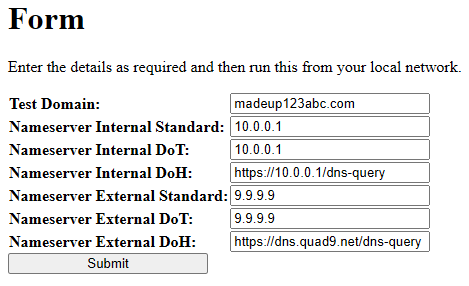
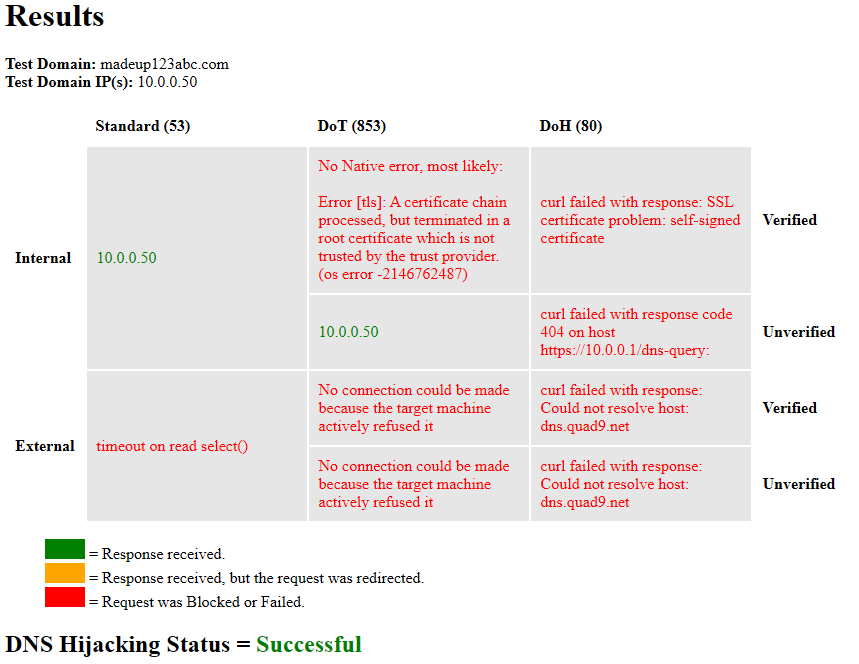

# DNS Hijacking Inspector
Test if DNS Hijacking on your local network is working as expected.

## What does it do?

It will test if `Standard (53)`, `DoT (853)`, `DoH(80)` DNS requests pointed to external servers are being blocked or redirected.

Once the test is complete it will give you an analysis of the tests with specific information about each type of DNS request.

## Prerequsites
You need the following:
- Your router must support `Domain Overrides` or have a `hosts file` you can edit.
- Webserver
  - on your local network
  - running PHP 8.1+
- PHP must have the following extensions installed and loaded
  - OpenSSL
  - cURL
  - Hash
  - Intl

## How to use this software
- Add a fake domain to your routers DNS server `Domain Overrides` or `hosts file` (e.g. `madeup123abc.com` / `10.0.0.50`)
- Extract `dns-hijacking-inspecto` to a folder of your choice on your Webserver
- Configure the settings in `inspector.php` as required
- Load `inspector.php`
- Read the results

## Configuration Options

### Script Only
- **$useForm (boolean):** Show the form
  - If this is enabled, then a form will appear for you to manually enter your details, otherwise the script will pull them directly from the it's settings and then automatically run itself.

### Script and Form
- **Test Domain:** This is the fake non-existant domain defined in your routers `Domain Overrides` or `hosts file` which is needed to test for DNS request redirects.
- **Nameserver Internal Standard:** The IP address of a `Standard DNS (53)` server on your local network.
  - This is most likely your router's IP.
- **Nameserver Internal DoT:** The IP address of a `DoT (853)` server on your local network.
  - This is most likely your router's IP.
  - Not all routers will offer this service.
- **Nameserver Internal DoH:** The HTTPS URL of a `DoH (80)` server on your local network.
  - This is most likely your router's IP.
  - Not all routers will offer this service.
- **Nameserver External Standard:** The IP address of a `Standard DNS (53)` server on the internet.
- **Nameserver External DoT:** The IP address of a `DoT (853)` server on the internet.
- **Nameserver External DoH:** The HTTPS URL of a `DoH (80)` server on the internet.

## Notes
- The `DoH` test only checks the domain supplied, so this test alone cannot indicated if all `DoH` requests are blocked or redirected. this test though can prove that your DNSBL is being applied as expected.
- To detect if a DNS request is redirected, a fake domain on your local router is required because this inspector cannot use the `Source IP` from the DNS response packet to determine if a request has been redirected as this information is lost in the discovery process of the **netdns2** library.
- Do not update **netdns2** via composer as this will remove the `DoH` peer verification relaxation workaround.

## Example Code
n/a

## Screenshots

### Form

### Results

## Results Explained

- **Internal**
  -  DNS requests sent to servers on your local network.
- **External**
  - DNS requests sent to servers on the internet.
- **Verified**
  - SSL/TLS certificates and hostnames are verified.
  - This only applies to `Dot` and `DoH`.
- **Unerified**
  - SSL/TLS certificates and hostnames are not verified.
  - This only applies to `Dot` and `DoH`.
  - This will allow you to test a servers response when they are using `self-signed` certificates.

## Limitations
- The `DoT` test has a workaround applied to show connections errors with servers that have `self-signed certificates`.
  - This is an issue with **netdns2** and I have reported the issue here [netdns2: DoT - Nameserver with Self Signed Certificate does not generate any errors when verify peers is enabled](https://github.com/mikepultz/netdns2/issues/182)
- ~~The `DoH` test currenly cannot check servers that have `self-signed certificates` because the `cURL` options cannot be configured to relax it's peer checks.~~
  - This is an issue with **netdns2** and I have reported the issue here [netdns2: Option to disable VERIFYPEER and VERIFYHOST for DoH requests](https://github.com/mikepultz/netdns2/issues/184)
  - I have added a workaround using static variables. Search for `// Temporary Workaround - DoH Peer Verification`
- This inspector cannot use the `Source IP` from the DNS response packet to determine if a request has been redirected because the information is lost in the discovery process of **netdns2**
  - This is an issue with **netdns2** and I have done a feature request here [netdns2: answer_from assumes the response comes from the supplied nameserver](https://github.com/mikepultz/netdns2/issues/183)

## Compatibility
This will work on most computers.

## License
This software is developed by QuantumWarp and released under the GNU General Public License v3

## Learn More
Visit this software's page at: https://github.com/shoulders/dns-hijacking-inspector

## Dependencies
I used the following packages to build this software.
- [netdns2 - PHP DNS Resolver and Updater](https://github.com/mikepultz/netdns2)
  - The NetDNS2 library is a pure PHP DNS Resolver library, that supports local caching, dynamic DNS updates, and almost every feature currently supported by modern DNS servers.
  - Supports DNS, DoT, DoH
  - Support for IPv4 and IPv6, UDP, TCP, and TLS sockets.
  - MIT License

## References
I used the following information and links to build this software.
- [Local network DNS Hijacking detection | GRC Forum](https://forums.grc.com/threads/local-network-dns-hijacking-detection.2383/)
  - It might be nice to get these Hijacking tests added in to the DNS Benchmark utility.
- Some other Packages I looked at
  - [Pure-PHP-DoH-Client](https://github.com/LJPc-solutions/Pure-PHP-DoH-Client)
    - Retrieve DNS records via DoH in PHP. This library finally makes it easy to query DNS records in PHP without any third party extensions.
  - [phpdns](https://github.com/purplepixie/phpdns)
    - This library provides a socket-level direct network DNS client (i.e. connects and sends queries to a remote DNS server, does not use local resolution).
